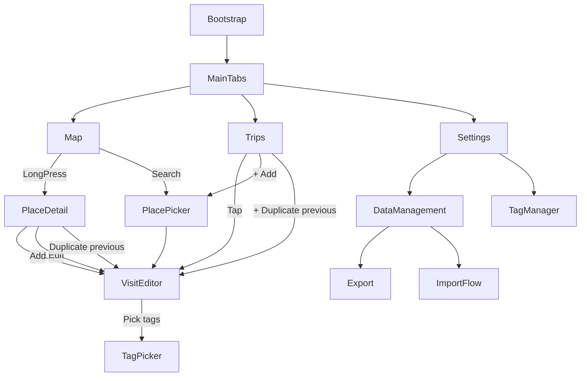

# 経国値アプリ 要件定義書（MVP最終版）

- **Document ID**: KEIKOKU-MVP-REQ
- **Version**: 1.0（会話内 Spec v0.1〜v0.6 を統合）
- **Date**: 2026-01-02
- **Scope**: MVP（写真なし / Placeマスタ固定同梱 / 完全オフライン利用可）

---

## 目次

1. [プロダクト概要](#プロダクト概要)
2. [用語定義](#用語定義)
3. [MVPスコープ](#mvpスコープ)
4. [プラットフォーム・実装方針（確定）](#プラットフォーム実装方針確定)
5. [経験レベルとスコア定義](#経験レベルとスコア定義)
6. [画面設計と画面遷移](#画面設計と画面遷移)
7. [地図仕様（2Dメルカトル/3D地球儀）](#地図仕様2dメルカトル3d地球儀)
8. [検索仕様（Place/Trips/Tags）](#検索仕様placetripstags)
9. [データモデル / DBスキーマ（SQLite）](#データモデル--dbスキーマsqlite)
10. [Import/Export仕様（JSON/CSV）](#importexport仕様jsoncsv)
11. [Import UI/エラーI-F](#import-uiエラーi-f)
12. [Placeマスタ & GeoJSON 生成パイプライン](#placeマスタ--geojson-生成パイプライン)
13. [Mapbox 実装仕様（Flutter）](#mapbox-実装仕様flutter)
14. [設定（Settings）仕様](#設定settings仕様)
15. [非機能要件](#非機能要件)
16. [受け入れ基準（Definition of Done）](#受け入れ基準definition-of-done)
17. [テスト仕様（E2E/ユニット/DB/IO/非機能）](#テスト仕様e2eユニットdbio非機能)
18. [付録：スタイルJSON / overrides雛形 / サンプルExport](#付録スタイルjson--overrides雛形--サンプルexport)

---

# プロダクト概要

## 目的

- 世界の **国/地域（Place）** を対象に、訪問経験を **0〜5点**で記録・可視化する。
- **経国値（Total Score）**＝全Placeの点数合計を表示する（経県値の国版MVP）。
- 入力導線は以下の2本を中核とする。
  1) **地図（長押し→Place詳細→旅行追加/編集）**  
  2) **旅行一覧タブ（Trips）**

## MVPの価値

- オフラインでも地図で塗り分けが見える。
- 国/地域ごとに複数の旅行（Visit）を蓄積できる。
- タグやタイトルで後から検索できる。
- JSON/CSVでデータを持ち出し/取り込みできる（旅行データのみ）。

## プライバシー方針（MVP）

- ユーザーデータは **端末内のみ**に保存する。
- ネット接続がなくても主要機能が動く（同期/共有はMVP外）。

---

# 用語定義

- **Place**: 本アプリで別カウントする単位。ISO主権国家だけでなく、香港/マカオ/プエルトリコ等の地域、コソボ/台湾/パレスチナ/西サハラ/北キプロス等も含む。
- **Visit（旅行/訪問記録）**: あるPlaceに対する1回分の記録。タイトル・日付・経験レベル・タグを持つ。同一Placeに複数Visitを登録可能。
- **Placeスコア**: そのPlaceの代表点（Visit群から集約）。
- **経国値（Total Score）**: 全PlaceのPlaceスコア合計。
- **マイスター（Mastery）**: 点数とは別に蓄積を示す表示。MVPでは **訪問回数**のみ表示。

---

# MVPスコープ

## MVPで実装する（Must）

### 地図
- 2D（メルカトル）/3D（地球儀）切替
- Place境界ポリゴンの塗り分け（0〜5）
- Place長押しで詳細表示（候補複数時は候補リスト）
- 経国値（合計点）表示

### 記録
- Place詳細でVisit一覧・追加・編集・削除
- 同一Placeに複数Visit
- 直前のVisit複製（多国周遊入力を高速化）

### 旅行一覧（Trips）
- 全Visit一覧
- 検索（タイトル/Place名/タグ）
- フィルタ（タグ/レベル）
- 並び：新しい旅行が上（仕様固定）

### タグ
- 作成/名称変更/削除
- Visitへ複数付与

### データ入出力
- JSON Export/Import（正式スキーマ v1）
- CSV Export/Import（visits.csv v1）

## MVPでは実装しない（Not now / Out of scope）

- 写真機能一式（Place直付け/代表写真含む）
- 未来の予定（planned）レイヤ
- 大陸別/年別/タグ別などの詳細統計UI（ただし拡張可能な設計）
- クラウド同期・バックアップZIP・共有

---

# プラットフォーム・実装方針（確定）

## 対応OS

- iOS / Android

## 実装スタック（MVPとして確定）

- **Flutter（単一コードベース）**
- 地図SDK: **Mapbox Maps SDK for Flutter（mapbox_maps_flutter）**
- ローカルDB: **SQLite**
  - 推奨: Drift / Floor など（ただしスキーマは本書のDDLに準拠）
- ファイル入出力:
  - Export: 端末の「共有」または「ファイル保存」へ書き出し
  - Import: OSのファイルピッカーで選択 → Preflight/Preview → 実行

> 注: Mapbox SDK利用には **アクセストークンが必要**。  
> MVPは「ベースマップ無し」「自前GeoJSONのみ」でも Mapbox SDKを使う以上、Mapboxの表示要件（wordmark等）を満たす。

---

# 経験レベルとスコア定義

## 経験レベル（0〜5）定義（UI表記も固定）

| 点 | ラベル（日本語） | 定義 |
|---:|---|---|
| 0 | 未踏 | Visitが存在しない（自動） |
| 1 | 乗継（空港のみ） | 空港施設内のみ（制限区域から出ない想定） |
| 2 | 乗継（少し観光） | 乗継だが空港外へ出た／短時間観光 |
| 3 | 訪問（宿泊なし） | 乗継ではない訪問だが宿泊なし |
| 4 | 観光（宿泊あり） | 宿泊を伴う滞在（観光/出張含む） |
| 5 | 居住 | 主観で手動選択（期間基準なし） |

### レベル2/3の説明文（UI確定）
- 2：空港外に出た“乗継”
- 3：乗継ではなく“訪問”だが宿泊なし

## 日付仕様（固定）

- 粒度: 日単位（`YYYY-MM-DD`）
- `start_date` / `end_date` は任意（NULL可）
- 両方ある場合 `start_date <= end_date`
- **1日滞在**は `start_date == end_date` で表現する

## スコア集計（点稼ぎ回避仕様：固定）

- **Placeスコア = そのPlaceに属するVisitの level の最大値（max）**
- **経国値 = 全Placeの Placeスコア 合計**
- Place詳細には **訪問回数（visit_count）**を表示（点数と分離）

---

# 画面設計と画面遷移

## タブ構成（固定）

- Map
- Trips
- Settings

## 画面一覧

- A0: Bootstrap（起動時同期・DBマイグレーション）
- A1: MainTabs
- M1: MapScreen
- M2: PlaceDetail（ボトムシート推奨、必要ならフルスクリーン）
- V1: VisitEditor（新規/編集）
- T1: TripsScreen（旅行一覧）
- P1: PlacePicker（検索/選択）
- S1: SettingsScreen
- S2: DataManagement（Export/Import）
- S3: TagManager
- D1: TagPicker（旅行編集内）
- D2: ConfirmDialog（削除/全消し等）

## 画面遷移図（Mermaid）



## 各画面の要件詳細

### M1: MapScreen

必須UI要素:
- 2D/3D切替トグル
- 経国値（合計点）表示
- 凡例（0〜5の意味）開閉
- 長押しでPlace選択
- （推奨）検索アイコン → PlacePicker

必須挙動:
- オフラインで表示できる（ベースマップなしでも可）
- Visitの編集結果が即座に色へ反映される（差分更新）

### M2: PlaceDetail

表示:
- Place名（表示設定に従い日本語/英語/併記）
- Placeスコア（0〜5）＋ラベル
- 訪問回数（visit_count）
- 当該PlaceのVisit一覧（新しい順）

操作:
- 旅行追加（＋）
- 直前旅行複製（ボタン）
- 旅行行タップで編集

Visit一覧の並び（PlaceDetail内）:
- `start_date` があるもの: start_date 降順
- start_date がないもの: updated_at 降順
- 同値は created_at 降順で安定化

### V1: VisitEditor（新規/編集共通）

入力項目（必須）:
- Place（変更可能）
- タイトル（必須、最大100文字推奨）
- レベル（1〜5）
- 開始日/終了日（任意、同日可）
- タグ（複数）
- メモ（任意、最大2000文字推奨）

バリデーション:
- title 非空（trim後）
- level 1..5
- start/end 両方ある場合 start<=end
- タグ名に `;` は禁止（CSV互換のため）

操作:
- 保存
- 削除（編集時のみ。ConfirmDialog必須）


### 直前旅行複製（MVP必須・仕様固定）

「多国周遊で同じ旅行名を複数Placeに入れる」ケースを最短入力できるようにする。

**直前（Previous）の定義**
- `updated_at` が最大の Visit を直前とする
- 同値の場合は `created_at` が最大の Visit を直前とする
- Visitが0件の場合、複製ボタンは非表示またはdisabled

**複製でコピーする項目（固定）**
- `title`
- `level`
- `tag_ids`（関連付けをコピー）
- `note`

**複製でコピーしない項目（固定）**
- `visit_id`（新規UUIDを採番）
- `created_at` / `updated_at`（現在時刻で新規）
- 日付（デフォルトはコピーしない。下記トグルで制御）

**日付コピー**
- VisitEditorに「日付もコピー」トグルを設ける（デフォルトOFF）
- ONの時のみ `start_date` / `end_date` を複製元からコピーする

**Placeの既定挙動（固定）**
- PlaceDetail（あるPlaceの詳細）から複製:
  - `place_code` は「現在表示中のPlace」をセット（=Placeだけ変える入力に最適）
- Tripsタブから複製:
  - `place_code` は「複製元Visitのplace_code」をセット（ユーザーが編集で変更可）

### T1: TripsScreen（旅行一覧）

表示:
- 全Visit一覧
- 各行: タイトル / Place名 / 日付 / レベル / タグ（省略可）

並び（仕様固定）:
1) `start_date` があるもの: start_date 降順
2) `start_date` がないもの: created_at 降順  
（混在時、start_dateありを上に）

検索:
- タイトル
- Place名（ja/en/alias）
- タグ名

フィルタ:
- タグ（単一選択）
  - 仕様: 選択したタグを含むVisitのみ表示
  - 将来拡張: 複数タグAND/ORは後日
- レベル（1〜5）

操作:
- 旅行追加（＋）→ PlacePicker → VisitEditor
- 直前旅行複製（＋メニューまたはボタン）

### P1: PlacePicker

- Place検索（ja/en/alias）
- 空クエリ時:
  - 最近訪問したPlace（last_visit_date降順）上位10
  - 既定の並び（sort_order上位）上位20
- タップで place_code を返す

### S1: Settings / S2: DataManagement / S3: TagManager

- 表示設定: Place名（日本語のみ/英語のみ/併記）
- 地図設定: 起動時のデフォルト投影（2D/3D）
- Data: Export/Import（JSON/CSV）
- Tags: 作成/リネーム/削除
- About: 境界の注意文、データ出典クレジット、Mapboxの表示要件

---

# 地図仕様（2Dメルカトル/3D地球儀）

## 目的

- オフラインでPlaceポリゴンを描画し、max_levelで塗り分ける
- 長押しでPlaceを特定する（境界近接・小島・重なりに強い）
- 2D/3Dを確実に切替可能（MVPは“スタイル切替”で実現）

## 地図データ

- 同梱: `assets/places/places.geojson.gz`
- 展開後: GeoJSON FeatureCollection
- 必須: `Feature.id == place_code`（文字列）
- 必須: `properties.place_code == place_code`
- 必須: `properties.draw_order`（数値）
- geometry: Polygon / MultiPolygon

## 重なり（territory等）の描画優先度

- properties.draw_order を使い、以下で制御する
  - sovereign: 100
  - territory: 200
  - partially_recognized: 300
  - special: 400
- Mapbox fill layer で `fill-sort-key = ["get","draw_order"]` を設定し、
  **draw_orderが大きいものが上に描画**されるようにする（仕様として固定）。

## レイヤ構成（MVP最小）

- places_fill（塗り）
- places_border（境界線）
- places_selected（選択ハイライト）

## 色分け（固定パレット）

`level`（0〜5）→ fill-color（HEX）:

| level | 色 | 意味 |
|---:|---|---|
| 0 | `#2B2B2B` | 未踏 |
| 1 | `#B3D9FF` | 乗継（空港のみ） |
| 2 | `#4DA3FF` | 乗継（少し観光） |
| 3 | `#4CAF50` | 訪問（宿泊なし） |
| 4 | `#FF9800` | 観光（宿泊あり） |
| 5 | `#E53935` | 居住 |

境界線: `#444C56`（1px）
選択ハイライト: `#FFFFFF`（2px）

## state更新方式（差分更新：固定）

- 地図の色は feature-state の `level` を参照して描画する
- 初期ロード時:
  - DBの place_stats から `max_level > 0` の place_code のみ state をセット
- Visit保存/削除/Place変更時:
  - 影響する place_code（旧/新）だけ DBから max_level を再取得し state更新

## 当たり判定（長押し）仕様（固定）

- 長押し認定時間: 450ms（可能ならOS差を吸収して統一）
- 長押し座標（screen point）から、**point中心の小さな矩形**（例：24×24px）で feature を拾う
- `queryRenderedFeatures` で places_fill を対象に取得
- 取得結果が:
  - 1件 → そのPlaceの詳細を開く
  - 複数 → 候補リストを表示して選択

候補リストの並び:
1) draw_order 降順
2) name_en 等で安定ソート

候補表示項目:
- Place名（設定に従う）
- type（小さく）
- 現在のlevel（色チップ可）

## 2D/3D切替仕様（固定）

- **Mercator用スタイルJSON** と **Globe用スタイルJSON** を用意し、切替時に `loadStyleJson` で読み替える方式（確実性優先）
- 切替時に保持するカメラ状態:
  - center（lat/lon）
  - zoom
  - bearing
  - pitch（2Dでは0、3Dでは任意の既定値も可）
- user_setting に保存:
  - default_projection（2D/3D）
  - last_camera（center/zoom/bearing/pitch）

---

# 検索仕様（Place/Trips/Tags）

## 正規化関数 normalize（固定）

入力文字列から search key を作る:

1) trim（前後空白除去）
2) 連続空白を1つに
3) 英字を小文字化
4) Unicode正規化（NFKD推奨）
5) combining mark除去（アクセントなど）
6) 記号（' ’ - . , ( ) 等）を削除または空白扱い

## Place検索（PlacePicker）— インメモリインデックス方式（固定）

- 起動時にDB（place/place_alias）から is_active=1 をロードし、以下 keys を生成:
  - normalize(name_ja)
  - normalize(name_en)
  - normalize(alias)
- 検索アルゴリズム（スコアリング）:
  - Exact（完全一致）
  - Prefix（前方一致）
  - Substring（部分一致）
- 並びキー:
  1) match種別（Exact > Prefix > Substring）
  2) last_visit_date が新しい（最近使ったPlaceを上に出す）
  3) sort_order 昇順
  4) name_en等で安定化
- 結果上限: 50件

空クエリ時:
- 最近訪問Place 上位10（last_visit_date 降順）
- 既定並び 上位20（sort_order 昇順）

## Trips検索（DBクエリ方式：固定）

検索対象:
- visit.title（部分一致）
- tag.name（部分一致）
- Place名（ja/en/alias）

推奨手順:
1) PlacePickerインデックスで place_code候補（最大50）を抽出
2) SQLで visit を `place_code IN (...)` で絞りつつ、タイトル/タグでLIKE検索

## Tag検索（固定）

- TagPickerはDBで `name_norm LIKE` を使用（tag数が増えても実用）

---

# データモデル / DBスキーマ（SQLite）

## 基本方針

- Placeは固定同梱で **place_codeが安定キー**
- 地図色・合計点計算を高速化するため `place_stats` を保持
- `place_stats` は visit の INSERT/UPDATE/DELETE でトリガにより再計算（整合性優先）

## 時刻・日付の表現（固定）

- `created_at` / `updated_at`: **UNIX epoch milliseconds（UTC）**（INTEGER）
- `start_date` / `end_date`: `"YYYY-MM-DD"`（TEXT、NULL可）

## DDL（確定）

> そのままSQLiteへ適用する（マイグレーションでも可）。

```sql
PRAGMA foreign_keys = ON;

CREATE TABLE IF NOT EXISTS meta (
  key TEXT PRIMARY KEY,
  value TEXT NOT NULL
);

CREATE TABLE IF NOT EXISTS place (
  place_code TEXT PRIMARY KEY,
  type TEXT NOT NULL,
  name_ja TEXT NOT NULL,
  name_en TEXT NOT NULL,
  is_active INTEGER NOT NULL DEFAULT 1,
  sort_order INTEGER NOT NULL DEFAULT 0,
  geometry_id TEXT,
  updated_at INTEGER NOT NULL
);

CREATE TABLE IF NOT EXISTS place_alias (
  place_code TEXT NOT NULL REFERENCES place(place_code) ON DELETE CASCADE,
  alias TEXT NOT NULL,
  alias_norm TEXT NOT NULL,
  PRIMARY KEY (place_code, alias_norm)
);

CREATE INDEX IF NOT EXISTS idx_place_alias_norm ON place_alias(alias_norm);

CREATE TABLE IF NOT EXISTS visit (
  visit_id TEXT PRIMARY KEY,
  place_code TEXT NOT NULL REFERENCES place(place_code),
  title TEXT NOT NULL,
  start_date TEXT,
  end_date TEXT,
  level INTEGER NOT NULL,
  note TEXT,
  created_at INTEGER NOT NULL,
  updated_at INTEGER NOT NULL,

  CHECK (length(trim(title)) > 0),
  CHECK (level BETWEEN 1 AND 5),
  CHECK (start_date IS NULL OR length(start_date) = 10),
  CHECK (end_date IS NULL OR length(end_date) = 10),
  CHECK (start_date IS NULL OR end_date IS NULL OR start_date <= end_date)
);

CREATE INDEX IF NOT EXISTS idx_visit_place_code ON visit(place_code);
CREATE INDEX IF NOT EXISTS idx_visit_start_date ON visit(start_date);
CREATE INDEX IF NOT EXISTS idx_visit_updated_at ON visit(updated_at);

CREATE TABLE IF NOT EXISTS tag (
  tag_id TEXT PRIMARY KEY,
  name TEXT NOT NULL,
  name_norm TEXT NOT NULL,
  created_at INTEGER NOT NULL,
  updated_at INTEGER NOT NULL,

  CHECK (length(trim(name)) > 0)
);

CREATE UNIQUE INDEX IF NOT EXISTS ux_tag_name_norm ON tag(name_norm);

CREATE TABLE IF NOT EXISTS visit_tag (
  visit_id TEXT NOT NULL REFERENCES visit(visit_id) ON DELETE CASCADE,
  tag_id TEXT NOT NULL REFERENCES tag(tag_id) ON DELETE CASCADE,
  PRIMARY KEY (visit_id, tag_id)
);

CREATE INDEX IF NOT EXISTS idx_visit_tag_tag_id ON visit_tag(tag_id);

CREATE TABLE IF NOT EXISTS place_stats (
  place_code TEXT PRIMARY KEY REFERENCES place(place_code) ON DELETE CASCADE,
  max_level INTEGER NOT NULL DEFAULT 0,
  visit_count INTEGER NOT NULL DEFAULT 0,
  last_visit_date TEXT,
  updated_at INTEGER NOT NULL
);

CREATE TABLE IF NOT EXISTS user_setting (
  key TEXT PRIMARY KEY,
  value TEXT NOT NULL,
  updated_at INTEGER NOT NULL
);
```

## place_stats トリガ（確定）

```sql
CREATE TRIGGER IF NOT EXISTS trg_visit_ai_place_stats
AFTER INSERT ON visit
BEGIN
  UPDATE place_stats
  SET
    visit_count = (SELECT COUNT(*) FROM visit WHERE place_code = NEW.place_code),
    max_level = COALESCE((SELECT MAX(level) FROM visit WHERE place_code = NEW.place_code), 0),
    last_visit_date = (SELECT MAX(COALESCE(end_date, start_date)) FROM visit WHERE place_code = NEW.place_code),
    updated_at = CAST(strftime('%s','now') AS INTEGER) * 1000
  WHERE place_code = NEW.place_code;
END;

CREATE TRIGGER IF NOT EXISTS trg_visit_ad_place_stats
AFTER DELETE ON visit
BEGIN
  UPDATE place_stats
  SET
    visit_count = (SELECT COUNT(*) FROM visit WHERE place_code = OLD.place_code),
    max_level = COALESCE((SELECT MAX(level) FROM visit WHERE place_code = OLD.place_code), 0),
    last_visit_date = (SELECT MAX(COALESCE(end_date, start_date)) FROM visit WHERE place_code = OLD.place_code),
    updated_at = CAST(strftime('%s','now') AS INTEGER) * 1000
  WHERE place_code = OLD.place_code;
END;

CREATE TRIGGER IF NOT EXISTS trg_visit_au_place_stats
AFTER UPDATE ON visit
BEGIN
  UPDATE place_stats
  SET
    visit_count = (SELECT COUNT(*) FROM visit WHERE place_code = OLD.place_code),
    max_level = COALESCE((SELECT MAX(level) FROM visit WHERE place_code = OLD.place_code), 0),
    last_visit_date = (SELECT MAX(COALESCE(end_date, start_date)) FROM visit WHERE place_code = OLD.place_code),
    updated_at = CAST(strftime('%s','now') AS INTEGER) * 1000
  WHERE place_code = OLD.place_code;

  UPDATE place_stats
  SET
    visit_count = (SELECT COUNT(*) FROM visit WHERE place_code = NEW.place_code),
    max_level = COALESCE((SELECT MAX(level) FROM visit WHERE place_code = NEW.place_code), 0),
    last_visit_date = (SELECT MAX(COALESCE(end_date, start_date)) FROM visit WHERE place_code = NEW.place_code),
    updated_at = CAST(strftime('%s','now') AS INTEGER) * 1000
  WHERE place_code = NEW.place_code;
END;
```

## 起動時のPlace同期（Bootstrap仕様：固定）

1) 同梱 `place_master.json` / `place_aliases.json` / `place_master_meta.json` を読み込む  
2) DBの meta に保存されている `place_master_hash` と比較  
3) hashが異なる場合のみ:
   - `place` を `place_code` で Upsert
   - `place_alias` を place_code単位で洗い替え（差分更新でも可）
4) `place_stats` に placeごとに1行が必ず存在するよう補完（max_level=0, visit_count=0）

---

# Import/Export仕様（JSON/CSV）

## 共通方針（固定）

- 文字コード: UTF-8
- Place参照は **必ず place_code**
- Export対象: **Visit + Tag** のみ（Placeマスタ/写真は含めない）
- Importは「安全側」:
  - 未知place_codeは取り込まない
  - 途中失敗でDBが壊れない（トランザクション）
- 前方互換:
  - JSONの未知フィールドは無視して取り込めること（推奨）

---

## JSON Export/Import（keikoku v1）

### トップレベル仕様

必須:
- `format`: `"keikoku"`
- `version`: `1`
- `exported_at`: ISO 8601 date-time（UTC推奨）
- `tags`: array（空可）
- `visits`: array（空可）

任意:
- `app`: `{ name, version, platform }`
- `place_master`: `{ revision, hash }`（同梱マスタ識別）

### Tag仕様

- `tag_id`（UUID）
- `name`（非空）
- `created_at` / `updated_at`（epoch ms、任意）

### Visit仕様

- `visit_id`（UUID）
- `place_code`（必須）
- `title`（非空）
- `level`（1..5）
- `start_date` / `end_date`（YYYY-MM-DD or null/欠落可、両方ある場合 start<=end）
- `tag_ids`（UUID配列、欠落時は空扱い）
- `note`（任意）
- `created_at` / `updated_at`（epoch ms、任意）

### JSON Schema（Draft 2020-12）

（実装ではこのschemaでvalidate可能）

```json
{
  "$schema": "https://json-schema.org/draft/2020-12/schema",
  "$id": "https://example.invalid/keikoku.schema.v1.json",
  "title": "Keikoku Export v1",
  "type": "object",
  "required": ["format", "version", "exported_at", "tags", "visits"],
  "additionalProperties": true,
  "properties": {
    "format": { "type": "string", "const": "keikoku" },
    "version": { "type": "integer", "const": 1 },
    "exported_at": { "type": "string", "format": "date-time" },
    "app": {
      "type": "object",
      "additionalProperties": true,
      "properties": {
        "name": { "type": "string" },
        "version": { "type": "string" },
        "platform": { "type": "string", "enum": ["ios", "android", "unknown"] }
      }
    },
    "place_master": {
      "type": "object",
      "additionalProperties": true,
      "properties": {
        "revision": { "type": "string" },
        "hash": { "type": "string" }
      }
    },
    "tags": {
      "type": "array",
      "items": { "$ref": "#/$defs/tag" }
    },
    "visits": {
      "type": "array",
      "items": { "$ref": "#/$defs/visit" }
    }
  },
  "$defs": {
    "uuid": {
      "type": "string",
      "pattern": "^[0-9a-fA-F]{8}-[0-9a-fA-F]{4}-[1-5][0-9a-fA-F]{3}-[89abAB][0-9a-fA-F]{3}-[0-9a-fA-F]{12}$"
    },
    "date_ymd": {
      "type": "string",
      "pattern": "^\\d{4}-\\d{2}-\\d{2}$"
    },
    "place_code": {
      "type": "string",
      "pattern": "^[A-Z0-9_]{2,16}$"
    },
    "tag": {
      "type": "object",
      "required": ["tag_id", "name"],
      "additionalProperties": true,
      "properties": {
        "tag_id": { "$ref": "#/$defs/uuid" },
        "name": { "type": "string", "minLength": 1 },
        "created_at": { "type": "integer", "minimum": 0 },
        "updated_at": { "type": "integer", "minimum": 0 }
      }
    },
    "visit": {
      "type": "object",
      "required": ["visit_id", "place_code", "title", "level"],
      "additionalProperties": true,
      "properties": {
        "visit_id": { "$ref": "#/$defs/uuid" },
        "place_code": { "$ref": "#/$defs/place_code" },
        "title": { "type": "string", "minLength": 1 },
        "start_date": { "anyOf": [{ "$ref": "#/$defs/date_ymd" }, { "type": "null" }] },
        "end_date": { "anyOf": [{ "$ref": "#/$defs/date_ymd" }, { "type": "null" }] },
        "level": { "type": "integer", "minimum": 1, "maximum": 5 },
        "tag_ids": {
          "type": "array",
          "items": { "$ref": "#/$defs/uuid" },
          "default": []
        },
        "note": { "type": "string" },
        "created_at": { "type": "integer", "minimum": 0 },
        "updated_at": { "type": "integer", "minimum": 0 }
      }
    }
  }
}
```

### JSON Import マージ規則（固定）

- 1インポートは **DBトランザクション**で実行
- Tag:
  1) tag_id一致 → 更新
  2) tag_idなし/不一致 → name_norm一致があれば既存にマップ
  3) 無ければ新規作成
- Visit:
  - place_code未知 → **スキップ**（issue記録）
  - visit_id一致 → 上書き更新（visit_tagは全置換）
  - 一致しない → 新規作成
- Visit.tag_ids:
  - 未知tag_id参照は無視（issue記録）

---

## CSV Export/Import（visits.csv v1）

### 形式（固定）

- UTF-8（Excel互換が必要ならUTF-8 BOM推奨）
- RFC4180準拠（`,`区切り、`"`エスケープ）
- ヘッダ行必須

### ヘッダ（固定）

```
visit_id,place_code,title,start_date,end_date,level,tags,note,created_at,updated_at
```

### 列仕様（固定）

- visit_id: UUID（空ならインポート時新規生成）
- place_code: 必須
- title: 必須
- start_date/end_date: 任意（YYYY-MM-DD or 空）
- level: 必須（1..5）
- tags: `;` 区切りのタグ名（空可）
  - 制約: タグ名に `;` を含めない
- note: 任意
- created_at/updated_at: epoch ms（空可。空なら現在時刻で補完）

### CSV Import 規則（固定）

- place_code未知 → 行スキップ（issue）
- level不正 → 行スキップ（issue）
- 日付形式不正/start>end → 行スキップ（issue）
- visit_idがあり既存 → 上書き更新（visit_tag全置換）
- visit_id空/未知 → 新規作成
- tags:
  - name_norm一致があれば既存タグにマップ
  - 無ければ新規作成して付与

### CSV Export 規則（固定）

- tagsは `name_norm` 昇順で `;` 結合
- created_at/updated_at も出力（往復の安定化）

---

# Import UI/エラーI-F

## ImportFlow（固定）

1) ファイル選択（json/csv）
2) Preflight（構造チェック・行/要素チェック）
3) Preview（取り込み要約＋問題一覧）
4) 実行（Import）
5) 結果（成功/更新/スキップ件数＋問題一覧）

## 実行モード（固定）

- 通常モード（デフォルト）: エラー行/要素はスキップして取り込む（正常分のみコミット）
- 厳格モード（任意トグル）: エラーが1件でもあれば全体中断（ロールバック）

## ImportIssue（固定）

- severity: `error | warning | info`
- code: エラーコード
- message: ユーザー向け短文
- location:
  - JSON: json_pointer（例: `$.visits[12].place_code`）
  - CSV: row_number（1始まり）+ column
- context（任意）:
  - visit_id / place_code / raw_value など

## エラーコード（MVP固定セット）

- FILE_UNREADABLE
- UNSUPPORTED_FORMAT
- INVALID_SCHEMA
- UNKNOWN_PLACE_CODE
- INVALID_UUID
- EMPTY_TITLE
- LEVEL_OUT_OF_RANGE
- INVALID_DATE_FORMAT
- START_AFTER_END
- TAG_NAME_INVALID
- UNKNOWN_TAG_ID

## Preview画面で表示する集計（必須）

- visits_total / visits_valid / visits_skipped
- visits_update / visits_insert
- tags_create
- issues_count（error/warning別）

---

# Placeマスタ & GeoJSON 生成パイプライン

## 目的

- Placeマスタ（place_code, names, type, sort/draw order, aliases）と、地図用GeoJSON（Feature.id=place_code）を **再現可能に生成**し、アプリに同梱する。
- アプリ更新で名称/境界が変わっても、Visitは place_code 参照のため破壊しない。

## 採用データソース（MVP固定）

- 境界: Natural Earth
  - admin-0 countries（基礎）
  - admin-0 breakaway/disputed areas（北キプロス、西サハラ等の上書き/追加用）
- 名称（ja/en）: CLDR territory names を build時に参照し、生成物に固定化
- 追加補正: overrides（YAML）で最終決定

> 補足: disputed系はNEの「breakaway/disputed」データを **上に重ねる**ことで、既存国家のgeometryを分割せずに個別選択可能にする。

## 生成物（同梱）

- `assets/places/place_master.json`
- `assets/places/place_aliases.json`
- `assets/places/place_master_meta.json`
- `assets/places/places.geojson.gz`

## place_code体系（固定）

- 原則: ISO 3166-1 alpha-2（例: JP, HK, MO, PR, TW, PS, EH）
- ISO相当が欠けるもの（例: Kosovo）:
  - アプリ独自コード（例: XK）
- 北キプロス等:
  - アプリ独自コード（例: XNC）

## 必須Place（ビルドで欠落したら失敗）

- HK, MO, PR, XK, TW, PS, EH, XNC

## リポジトリ構成（推奨）

```
data/raw/natural_earth/...
data/raw/cldr/...
data/overrides/place_overrides.yaml
data/overrides/place_aliases_extra.yaml
tools/build_places/build_places.py
tools/build_places/validate_places.py
assets/places/*.json
assets/places/places.geojson.gz
```

## build_places.py 処理フロー（固定）

1) NE countries 読み込み → place_code割当
2) NE breakaway/disputed 読み込み → place_code割当（overrides必須）
3) type決定（NE属性 + overrides）
4) name_ja/name_en 決定（CLDR + overrides）
5) aliases生成（CLDR/別名 + 手動追加）
6) geometry簡略化・正規化（島が消えない範囲で）
7) GeoJSON出力（Feature.id=place_code）
8) master/aliases/meta出力

## validate_places.py（CIで必須、落ちたらビルド失敗）

- place_master:
  - place_code一意
  - 必須Place存在
- geojson:
  - Feature.id一意
  - Feature.id と properties.place_code一致
- master と geojson の place_code集合が完全一致（片方だけ存在禁止）
- places.geojson.gz が上限サイズ（例: 10MB）以下

## place_master_meta.json（固定）

- `revision`: 生成に使ったデータのバージョン文字列（任意形式）
- `hash`: 生成物のsha256等

アプリ側Bootstrapは hash を比較して必要ならUpsert。

---

# Mapbox 実装仕様（Flutter）

## アクセストークン設定（固定）

- ビルド/実行時に `--dart-define ACCESS_TOKEN=...` で渡す
- アプリ起動時に `MapboxOptions.setAccessToken(ACCESS_TOKEN);` を実行


## Mapboxのロゴ/Attribution（表示要件・MVP固定）

- Mapbox Maps SDK を利用する以上、**Mapbox wordmark（ロゴ）を常に表示**する（ユーザー設定で非表示にしない）
- Attribution（著作権/データ提供表記）も **常に表示**する（本アプリは非Mapboxデータ中心だが、安全側で常時表示とする）
- ロゴ/Attributionの位置はUIに合わせて移動してよい（例: 右下）が、**常に地図上で可視**であること
- 画面内の他UI（合計点、凡例、FAB等）と重なる場合は、UI側の余白/インセットで必ず回避する

## スタイル（オフライン成立のため固定）

- Mapbox Standard 等のオンラインスタイルは使わない
- **背景 + 自前GeoJSONのみ**のローカルスタイルJSONを使用
- 2D/3DはスタイルJSONの `"projection"` を変え、`loadStyleJson` で切替
- スタイル切替時は layers/sources が消えるため、**style loaded後に必ず再登録**する

## Source/Layers追加（固定）

- style loadedイベント後に:
  1) GeoJsonSource（id: places）を追加
     - data: 解凍した GeoJSON文字列
     - generateId: false（Feature.idを保持）
  2) FillLayer / LineLayer / LineLayer（selected）を追加

## 描画式（固定）

- fill-color は feature-state.level を参照（未設定は0扱い）
- fill-sort-key は draw_order を参照

## Place選択（固定）

- 長押し時に queryRenderedFeatures を使う
  - pointではなく「小さな矩形」で拾う
- 複数候補なら候補リスト表示
- 選択中place_codeは state（selected=true）や別レイヤでハイライト

## 変更反映（固定）

- Visitの保存/削除/移動が起きたら:
  1) 影響place_codeの place_stats.max_level をDBから取得
  2) map.setFeatureState で該当place_codeに level を反映

---

# 設定（Settings）仕様

## 設定項目（MVP固定）

- 表示: `place_name_display` = `ja | en | both`
- 地図: `default_projection` = `mercator | globe`
- 地図: `last_camera`（center/zoom/bearing/pitch）
- データ: Export（JSON/CSV）
- データ: Import（JSON/CSV）
- データ: 全データ削除（ConfirmDialog必須）
  - 削除対象: `visit`, `tag`, `visit_tag`（ユーザーデータのみ）
  - リセット: `place_stats` を全行 `max_level=0, visit_count=0, last_visit_date=NULL` にする
  - 保持: `place`, `place_alias`（同梱マスタ）, `user_setting`（表示/地図設定は保持）

- About:
  - 境界は便宜で政治的主張ではない
  - Natural Earth / CLDR / Mapbox のクレジット
  - Mapbox wordmark/attribution の表示要件順守

---

# 非機能要件

## パフォーマンス

- Place数 300〜400、Visit数 5,000 程度で実用速度
- PlaceDetail表示/Trips検索が体感で遅延しない
- 地図のパン/ズーム/回転がストレスなく動く

## 信頼性

- すべてのDB更新はトランザクション
- ImportはPreflight/Previewで事故を防ぐ
- トリガ整合性が崩れない

## セキュリティ/プライバシー

- MVPはクラウド送信なし
- Export/Importはユーザー操作でのみ実行
- 将来、DB暗号化やアプリロックを追加できる構造を阻害しない

---

# 受け入れ基準（Definition of Done）

MVP完了条件（全て必須）:

1) 機内モードで起動できる（地図表示・2D/3D切替可）
2) Place長押しで詳細が開く（候補複数時は選べる）
3) Visit追加/編集/削除で:
   - Placeの色（max_level）が即反映される
   - 経国値が即反映される
4) Tripsで:
   - 新しい順（start_date優先、無い場合created_at）に並ぶ
   - 検索/フィルタが動く
5) 直前旅行複製が動く（PlaceDetail起点ではPlaceがそのPlaceになる）
6) JSON/CSVのExport/Importが往復で成立する（未知place_codeはスキップしエラー表示）

---

# テスト仕様（E2E/ユニット/DB/IO/非機能）

## E2E（手動 or 自動）

- E2E-01 オフライン起動（機内モード）
- E2E-02 Place長押し→詳細表示
- E2E-03 Visit追加→地図色/経国値更新
- E2E-04 同一Placeへ低レベル追加してもmaxが下がらない
- E2E-05 Visit編集でplace_code変更→旧/新が正しく再計算
- E2E-06 Trips並び順（start_dateあり優先）
- E2E-07 直前複製（デフォルト日付コピーOFF）
- E2E-08 タグ作成→付与→削除（参照不整合なし）
- E2E-09 JSON Export→全消し→Import→復元
- E2E-10 CSV Export→全消し→Import→復元

## ユニット（ロジック）

- U-01 日付バリデーション（start>end invalid / 同日 valid / null許容）
- U-02 Placeスコア（max）計算
- U-03 経国値（Σmax_level）
- U-04 直前Visit選定（updated_at最大、同値はcreated_at）
- U-05 Trips並び順キー

## DBテスト

- DB-01 visit制約（level/title/date）
- DB-02 place_statsトリガ（insert/update/delete/move）
- DB-03 cascade（visit_tagの消し込み）
- DB-04 tag名ユニーク（name_norm）

## IOテスト（Import/Export）

- IO-01 JSON schema適合
- IO-02 JSON二重Importで重複しない（visit_id更新）
- IO-03 未知place_codeのスキップとissue表示
- IO-04 CSV tags解析（空/複数/不正`;`）

## 非機能

- NF-01 データ量（Visit 5,000 / Tag 200）で検索が実用
- NF-02 オフライン耐性（起動/Export/Import）

---

# 付録：スタイルJSON / overrides雛形 / サンプルExport

## A. 最小スタイルJSON（Mercator）

`assets/map/style_mercator.json`

```json
{
  "version": 8,
  "name": "keikoku_mercator",
  "projection": { "name": "mercator" },
  "sources": {},
  "layers": [
    {
      "id": "background",
      "type": "background",
      "paint": { "background-color": "#101418" }
    }
  ]
}
```

## B. 最小スタイルJSON（Globe）

`assets/map/style_globe.json`

```json
{
  "version": 8,
  "name": "keikoku_globe",
  "projection": { "name": "globe" },
  "sources": {},
  "layers": [
    {
      "id": "background",
      "type": "background",
      "paint": { "background-color": "#101418" }
    }
  ]
}
```

## C. placesレイヤ追加（概念: Mapbox style expressions）

FillLayer（places_fill）:
- source: `places`
- layout:
  - `fill-sort-key`: `["get","draw_order"]`
- paint:
  - `fill-opacity`: 0.7
  - `fill-color`: 
    - `["match", ["coalesce", ["feature-state","level"], 0], 0,"#2B2B2B",1,"#B3D9FF",2,"#4DA3FF",3,"#4CAF50",4,"#FF9800",5,"#E53935", "#2B2B2B"]`

LineLayer（places_border）:
- `line-color`: `#444C56`
- `line-width`: 1

LineLayer（places_selected）:
- filter: `["==", ["feature-state","selected"], true]`（またはstateを参照する式）
- `line-color`: `#FFFFFF`
- `line-width`: 2

## D. overrides雛形（必須Place保証）

`data/overrides/place_overrides.yaml`

```yaml
# place_code: 最終的にアプリで使う安定キー
# source_ref: NEのどのfeatureに対応するか（nameや属性で指定するなど、実装に合わせる）
# type/draw_order/name_ja/name_en などを最終上書きする

- place_code: HK
  type: territory
  draw_order: 200
  name_en: "Hong Kong"
  name_ja: "香港"
  aliases: ["Hong Kong SAR", "香港特別行政区"]

- place_code: MO
  type: territory
  draw_order: 200
  name_en: "Macau"
  name_ja: "マカオ"
  aliases: ["Macao", "Macau SAR", "澳門"]

- place_code: PR
  type: territory
  draw_order: 200
  name_en: "Puerto Rico"
  name_ja: "プエルトリコ"

- place_code: XK
  type: partially_recognized
  draw_order: 300
  name_en: "Kosovo"
  name_ja: "コソボ"

- place_code: TW
  type: special
  draw_order: 400
  name_en: "Taiwan"
  name_ja: "台湾"

- place_code: PS
  type: partially_recognized
  draw_order: 300
  name_en: "Palestine"
  name_ja: "パレスチナ"

- place_code: EH
  type: disputed
  draw_order: 300
  name_en: "Western Sahara"
  name_ja: "西サハラ"

- place_code: XNC
  type: partially_recognized
  draw_order: 300
  name_en: "Northern Cyprus"
  name_ja: "北キプロス"
```

## E. サンプルExport（JSON）

```json
{
  "format": "keikoku",
  "version": 1,
  "exported_at": "2026-01-02T00:00:00Z",
  "app": { "name": "Keikoku", "version": "0.1.0", "platform": "android" },
  "tags": [
    { "tag_id": "11111111-1111-4111-8111-111111111111", "name": "学会" }
  ],
  "visits": [
    {
      "visit_id": "22222222-2222-4222-8222-222222222222",
      "place_code": "JP",
      "title": "学会＠東京",
      "level": 4,
      "start_date": "2026-01-02",
      "end_date": "2026-01-03",
      "tag_ids": ["11111111-1111-4111-8111-111111111111"],
      "note": "発表した",
      "created_at": 1767312000000,
      "updated_at": 1767312000000
    }
  ]
}
```

---
